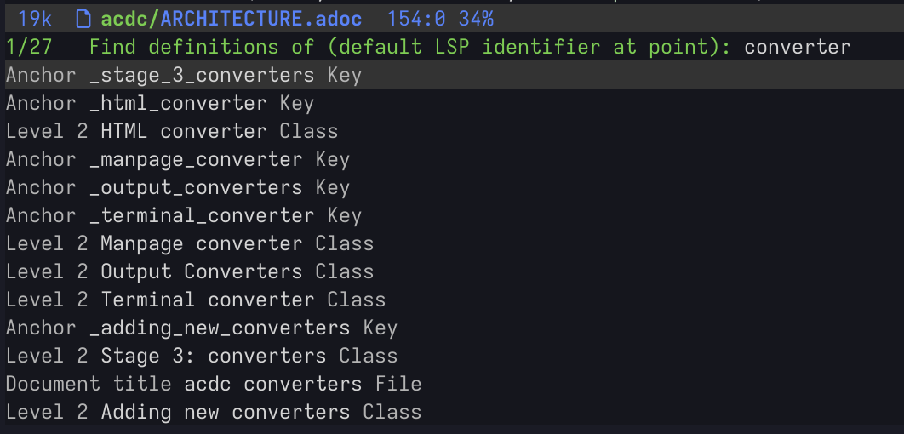

# Changelog

All notable changes to `acdc-lsp` will be documented in this file.

The format is based on [Keep a Changelog](https://keepachangelog.com/en/1.1.0/),
and this project adheres to [Semantic Versioning](https://semver.org/spec/v2.0.0.html).

## [Unreleased]

### Fixed

- **Cross-file xref go-to-definition** — fallback to global anchor index when direct file+anchor
  lookup fails, mirroring the existing pattern for local xrefs.
- **Cross-file xref to unopened files** — read and parse target files from disk when they aren't
  open in the editor, so go-to-definition works without opening the target file first.
- **Cross-file xref find-references** — include anchor definition from on-disk files when the
  target document isn't open, so find-references shows the definition location.
- **Cross-file xref diagnostics** — suppress info diagnostic for cross-file xrefs when the target
  anchor is found in the workspace-wide index.

### Added

- **Workspace symbols** (`workspace/symbol`) — search sections, anchors, discrete headers, block
  titles, and document attributes across all project files. Scans workspace roots for `.adoc`,
  `.asciidoc`, and `.asc` files on initialization; open documents use live ASTs while closed files
  use cached symbols.

  
- **Cross-file reference support** — workspace-wide anchor indexing across all open documents.
  - Go-to-definition navigates between files via `xref:file.adoc#anchor[text]`.
  - Hover shows cross-file target information (file name, anchor status).
  - Find references discovers xrefs across all open documents.
  - Completion suggests anchors from other open files with `file.adoc#anchor` insertion.
  - Rename updates anchor IDs and all xrefs across all open files.
  - Diagnostics emit info-level notes for cross-file xrefs instead of false warnings.
- **Include directive links** — `include::file.adoc[]` directives appear as clickable document
  links in the editor.
- **Relative path resolution** — relative paths in link macros and images are now resolved
  against the document's directory and appear as clickable links.

## [0.1.0] - 2025-12-28

Initial release of acdc-lsp, a Language Server Protocol implementation for AsciiDoc.

### Added

- Go-to-definition support
- Hover information
- Completion suggestions
- Diagnostics
- Semantic tokens

[Unreleased]: https://github.com/nlopes/acdc/compare/acdc-lsp-v0.1.0...HEAD
[0.1.0]: https://github.com/nlopes/acdc/releases/tag/acdc-lsp-v0.1.0
