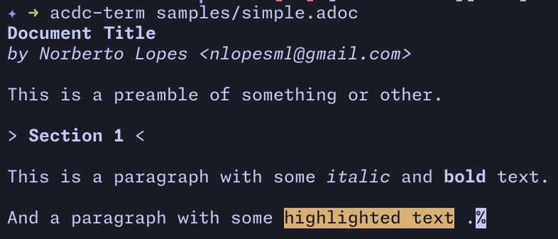

# `acdc-term`

A simple terminal parser for `AsciiDoc` documents.

## Usage

```bash
acdc-term samples/simple.adoc
```



You can also pass multiple files and it will parse and print them all.

```bash
acdc-term samples/*
```
