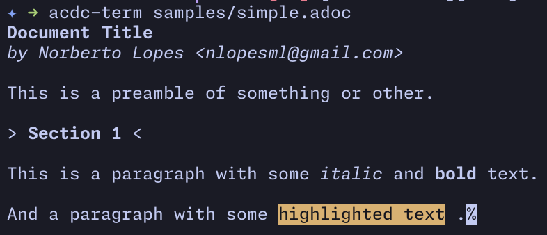

# `acdc-terminal`

A simple terminal parser for `AsciiDoc` documents.

## Usage

[source,console]
....
acdc-cli --backend terminal simple.adoc
....

You can also pass multiple files and it will parse and print them all.

[source,console]
....
acdc-cli --backend terminal *.adoc
....

## Examples

Here's a simple table.

image::images/table.adoc.png["Table Example"]

## TODO

- [] Add `syntect` for syntax highlighting in literal code blocks
