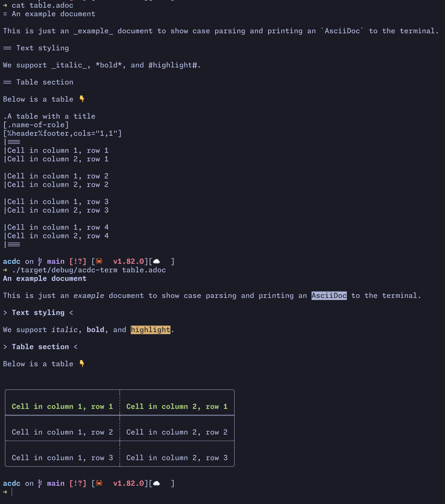

# `acdc-terminal`

A simple terminal parser for `AsciiDoc` documents.

## Usage

```bash
acdc-cli --backend terminal simple.adoc
```


You can also pass multiple files and it will parse and print them all.

```bash
acdc-cli --backend terminal *.adoc
```

## Examples

Here's a simple table.



## TODO

- [] Add `syntect` for syntax highlighting in literal code blocks
