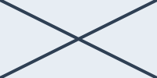

= Silent Metadata
:toc: macro
:icons: image
:iconsdir: .
:icontype: svg
:source-highlighter: rouge

[%noheader%nofooter]
toc::[]

== Built-in paragraph roles

[.big]
Big paragraph role.

[.small]
Small paragraph role.

[.subtitle]
Subtitle paragraph role.

[.underline]
Underlined paragraph role.

[.line-through]
Struck paragraph role.

Inline pre-wrap keeps [.pre-wrap]#two  spaces  together# and [.pre-wrap]`two  monospace  spaces`.

== List marker styles

[disc]
* Disc marker
** Nested default circle marker

[circle]
* Circle marker
** Nested default circle marker

[square]
* Square marker
** Nested default circle marker

[none]
* Unordered item without a marker
** Nested item with the default circle marker

[no-bullet]
* Unordered item without a marker
** Nested item with the default circle marker

[unstyled]
* Unordered item without a marker or marker indentation
** Nested item with the default circle marker

[unnumbered]
. Ordered item without a marker
.. Nested item with default lower-alpha numbering

[no-bullet]
. Ordered item without a marker or marker indentation
.. Nested item with default lower-alpha numbering

[unstyled]
. Ordered item without a marker or marker indentation
.. Nested item with default lower-alpha numbering

[none]
. Ordered item with empty marker spacing
.. Nested item with default lower-alpha numbering

== Admonition icon override

[icon=inline-image-dimensions]
NOTE: This admonition uses a block-specific image icon.

== Image sizing and fitting

[%align-to-page]

****
[%align-to-page]

****

Inline intrinsic scale  and inline content width .

Inline line fit  and inline unrestricted fit .

== Source highlighting fallback

[source,php,options=mixed]
----

<?php echo "mixed mode"; ?>

----

== Breakable table

.Caption kept with the first row
[#breakable-table%breakable]
|===
|First row

|Second row
|===

== Page layout fallback

[page-layout=landscape]
<<<

The landscape request keeps the document layout and produces a diagnostic.

[.portrait]
<<<

The portrait request also keeps the document layout.
