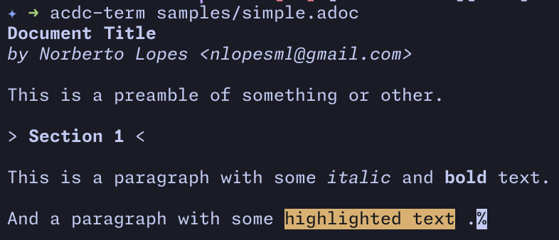
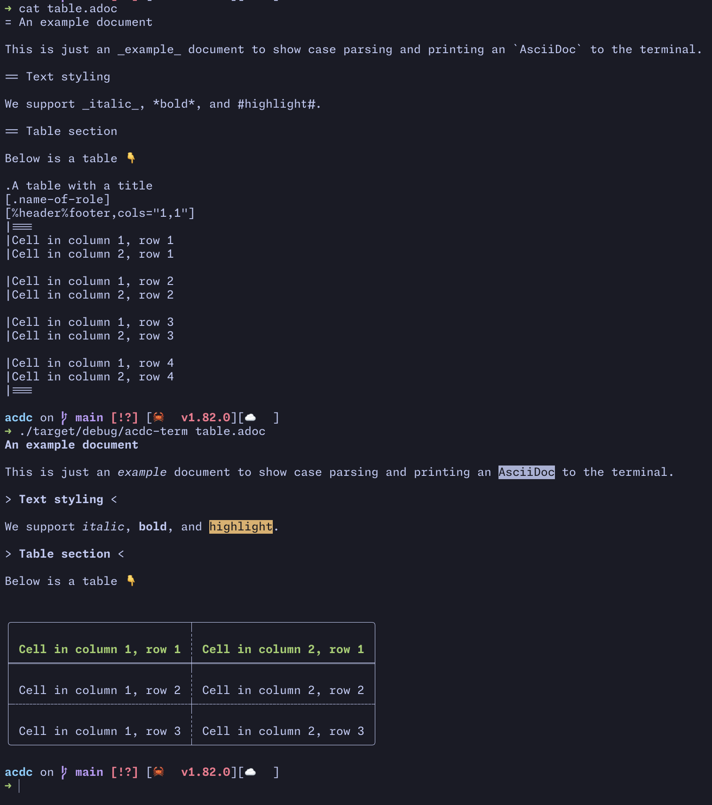

# `acdc-converters-terminal`

A simple terminal converter for `AsciiDoc` documents.

## Usage

[source,console]
....
acdc convert --backend terminal simple.adoc
....

When stdout is a TTY, output is automatically piped through a pager (defaults to `less -FRX` on Unix, `more` on Windows). Use `--no-pager` to disable, or set the `PAGER` environment variable for a custom pager.

[source,console]
....
acdc convert --backend terminal --no-pager simple.adoc
....



You can also pass multiple files and it will parse and print them all.

[source,console]
....
acdc convert --backend terminal *.adoc
....

## Examples

Here's a simple table.



## Image Rendering

If we can detect your terminal supports images, we'll render the image, assuming you have
your `TERM` set up correctly.

If you're using Ghostty or Kitty for example (and you're not overriding your `TERM`) you
might have it set up to something that allows us to detect support for the right protocol.

```
TERM=xterm-kitty
```

## Syntax Highlighting

Code blocks with the `[source,language]` attribute get automatic syntax highlighting in the terminal using `syntect`. The terminal converter supports 40+ programming languages including:

- Rust, Python, JavaScript, TypeScript, Go, Java, C, C++
- Bash, Shell scripting, Zsh, Fish
- Ruby, PHP, Perl, Lua, Swift, Kotlin, Scala
- HTML, CSS, XML, JSON, YAML, TOML
- SQL, Dockerfile, Makefile

Example:

[source,asciidoc]
....
[source,rust]
----
fn main() {
    println!("Hello, world!");
}
----
....

The highlighted code will display with appropriate colors for your terminal. If a language isn't recognized or no language is specified, the code block renders as plain text.

## Development

The terminal converter includes headless integration tests that feed converter
output through Ghostty's virtual terminal emulator and assert on rendered cells.
These tests use `libghostty-vt`, whose native build requires the prerequisites
listed in link:../../CONTRIBUTING.md[CONTRIBUTING.md].

To reuse an existing Ghostty checkout instead of letting the build fetch one,
set `GHOSTTY_SOURCE_DIR` to a checkout containing `build.zig`:

[source,bash]
----
GHOSTTY_SOURCE_DIR=/path/to/ghostty cargo nextest run -p acdc-converters-terminal --all-features
----

To run only the Ghostty-backed tests:

[source,bash]
----
cargo nextest run -p acdc-converters-terminal --test headless_terminal_test --all-features
----
