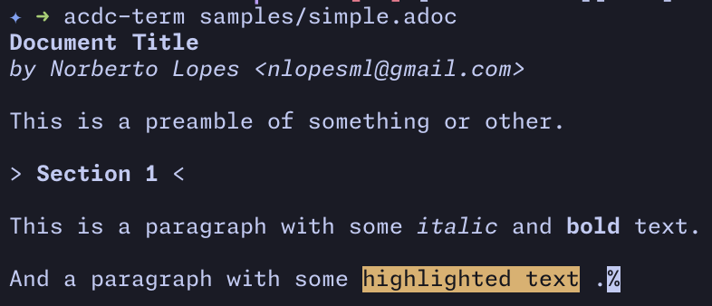
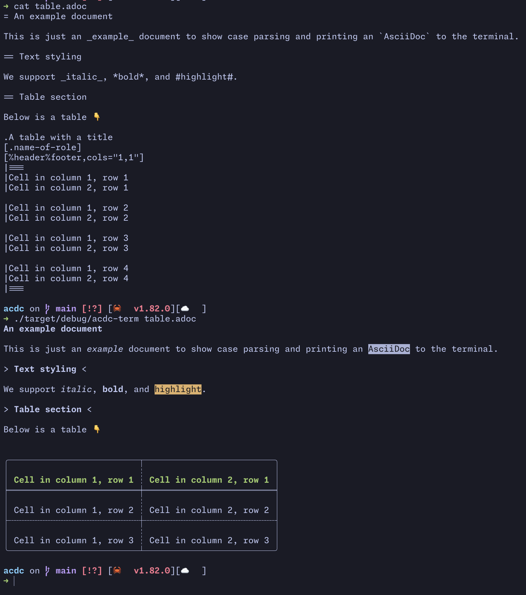

# `acdc-converters-terminal`

A simple terminal converter for `AsciiDoc` documents.

## Usage

[source,console]
....
acdc convert --backend terminal simple.adoc
....

When stdout is a TTY, output is automatically piped through a pager (defaults to `less -FRX` on Unix, `more` on Windows). Use `--no-pager` to disable, or set the `PAGER` environment variable for a custom pager.

[source,console]
....
acdc convert --backend terminal --no-pager simple.adoc
....



You can also pass multiple files and it will parse and print them all.

[source,console]
....
acdc convert --backend terminal *.adoc
....

## Examples

Here's a simple table.



## Image Rendering

With the `images` feature, local block images are sent to `viuer`. If the image
cannot be displayed, or the feature is disabled, the converter prints useful
alternative text and the source instead. Remote images are not fetched.

An image `link` is kept as an OSC 8 link when the terminal supports OSC 8. Other
terminals show the target after the image label. An inline image's own link takes
precedence over a link around the image.

Positive integer `width` and `height` values are interpreted as terminal-cell
dimensions for protocol images. `align=center` and `align=right` are applied when
an integer width is available. Percentage dimensions, page-relative sizing,
wrapping floats, and alignment without a known cell width have no terminal-image
equivalent.

If you're using Ghostty or Kitty for example (and you're not overriding your `TERM`) you
might have it set up to something that allows us to detect support for the right protocol.

```
TERM=xterm-kitty
```

## Syntax Highlighting

Code blocks with the `[source,language]` attribute get automatic syntax highlighting in the terminal using `syntect`. The terminal converter supports 40+ programming languages including:

- Rust, Python, JavaScript, TypeScript, Go, Java, C, C++
- Bash, Shell scripting, Zsh, Fish
- Ruby, PHP, Perl, Lua, Swift, Kotlin, Scala
- HTML, CSS, XML, JSON, YAML, TOML
- SQL, Dockerfile, Makefile

Example:

[source,asciidoc]
....
[source,rust]
----
fn main() {
    println!("Hello, world!");
}
----
....

The highlighted code will display with appropriate colors for your terminal. If a language isn't recognized or no language is specified, the code block renders as plain text.

Source blocks honor `linenums`, `start`, and `highlight`. Callout comment guards
are removed and the visible callout marker is emphasized. Source substitutions,
Unicode text, and long lines are preserved. PHP `%mixed` highlighting falls back
to normal PHP highlighting and reports one warning per document.

## Terminal Semantics

The terminal backend keeps document structure in a static form:

* Table-of-contents entries keep section and part numbering.
* Book chapters use `chapter-signifier`; `%notitle` hides a heading but keeps its
  content and reference text.
* Internal cross-references and footnotes are styled display references. They are
  not terminal jump targets. Inline and block anchors remain invisible.
* Example and abstract paragraphs, open blocks, quote and verse attributions,
  list marker styles, bibliography labels, and supported text roles have distinct
  terminal presentations.
* `lead` and `big` use emphasis, `small` is dimmed, `subtitle` is italic,
  `underline` is underlined, and `line-through` is crossed out. Arbitrary CSS
  roles have no terminal presentation.
* Admonitions use their text label when icons are disabled. Emoji icons are used
  only when icons and Unicode output are enabled.

Tables honor percentage `width`, `%autowidth`, horizontal placement, column and
cell alignment, vertical alignment, headers, footers, spans, frames, grids, and
static stripes. Content can still be truncated when it cannot fit the selected
terminal width.

Links honor `hide-uri-scheme` in their visible text while preserving the complete
target in OSC 8 metadata or the non-OSC 8 suffix. Browser-window attributes and
arbitrary CSS roles are HTML-only; they do not change terminal links and do not
produce warnings.

Audio and video macros are static links in terminal output. They do not provide
playback. Titles, audio time fragments, video posters, and all alternative video
sources are kept. Audio or video with no source reports one warning per media
kind and document.

## Development

The terminal converter includes headless integration tests that feed converter
output through Ghostty's virtual terminal emulator and assert on rendered cells.
These tests use `libghostty-vt`, whose native build requires the prerequisites
listed in link:../../CONTRIBUTING.md[CONTRIBUTING.md].

To reuse an existing Ghostty checkout instead of letting the build fetch one,
set `GHOSTTY_SOURCE_DIR` to a checkout containing `build.zig`:

[source,bash]
----
GHOSTTY_SOURCE_DIR=/path/to/ghostty cargo nextest run -p acdc-converters-terminal --all-features
----

To run only the Ghostty-backed tests:

[source,bash]
----
cargo nextest run -p acdc-converters-terminal --test headless_terminal_test --all-features
----
